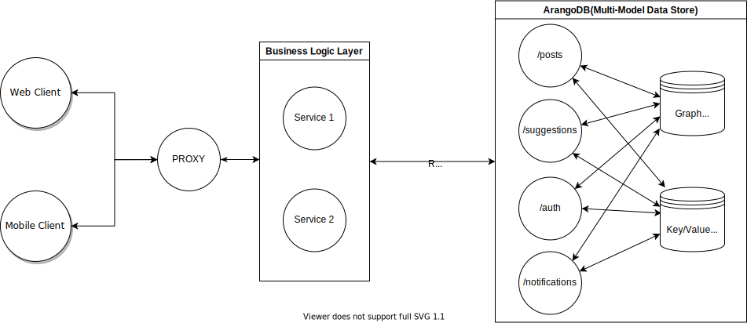

# Zuck Life

This Project demonstrates how to use "The Foxx Way" architectural pattern to build a social media app on graphs.

For more information you can:

- Watch the webinar were I described the benefits of this architecture: https://youtu.be/VTXIL-fmSxY
- Check out the presentation in the video mentioned above - https://rasjonell.github.io/presentations
- Read an article on Foxx services - https://rasjonell.tech/posts/2020-02-03-foxx-typescript.html

## Project Architecture



## Project Structure

```
├── README.md
├── frontend (React         - Javascript)
├── API      (Express/Proxy - Typescript)
└── services (Foxx          - Typescript)
    ├── auth  (Sessions logic)
    ├── posts (Posts, comments, ratings)
    └── user  (Followings, timelines, etc.)
```

## Running The App

- Install the dependencies:

  ```sh
  ./install_packages.sh
  ```

- Run `arangodb` with a specified config file

  ```sh
  arangod -c <PATH-TO-CONFIG>/arangod.conf
  ```

  (note: you need to have `--http.trusted-origin *` option for your services to be able to send credentials via the reverse-proxy)

- Run each service:
  - Frontend - `yarn start`
  - API - `npm run watch`
  - Services
    - {Auth,User,Posts} - `npm run install:service`
